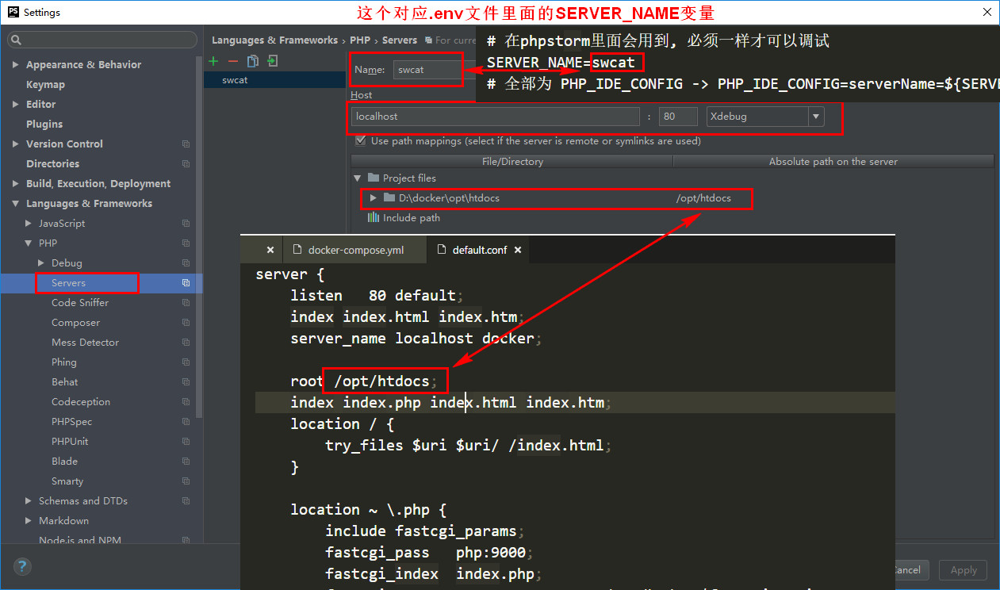

```
mysql
  - mysql dockerfile
  - 配置文件

nginx 
  - nginx dockerfile
  - nginx 配置文件
  - nginx 默认的vhost(sites-enabled)

php
  - php7.1.3 dockerfile
  - php.ini
  - php-fpm配置
  - debian的阿里源

redis
  - redis dockerfile

opt
  - conf           配置文件
    -nginx.vhost   nginx vhost文件
  - data           数据库等文件
  - htdocs         网站目录
  - logs           日志目录
```

编译完全通过, 基本测试没有问题, 后续会根据使用更新
在长城宽带等二级宽带由于下载问题, 会出现很多的这样那样的问题, 换成电信就好了

~~请把本项目clone下载放到d盘的根目录下面并把项目文件夹命名为docker, 第一次写, 参数都是写死的~~
请打开`.env文件` 根据需求编辑, 里面有说明

如果需要配合xdebug + phpstorm调试的, 请看下图

